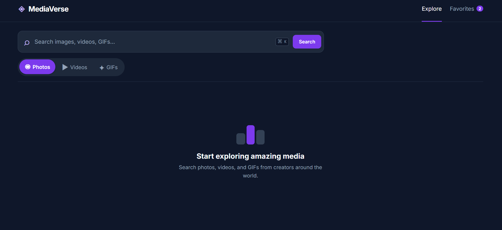
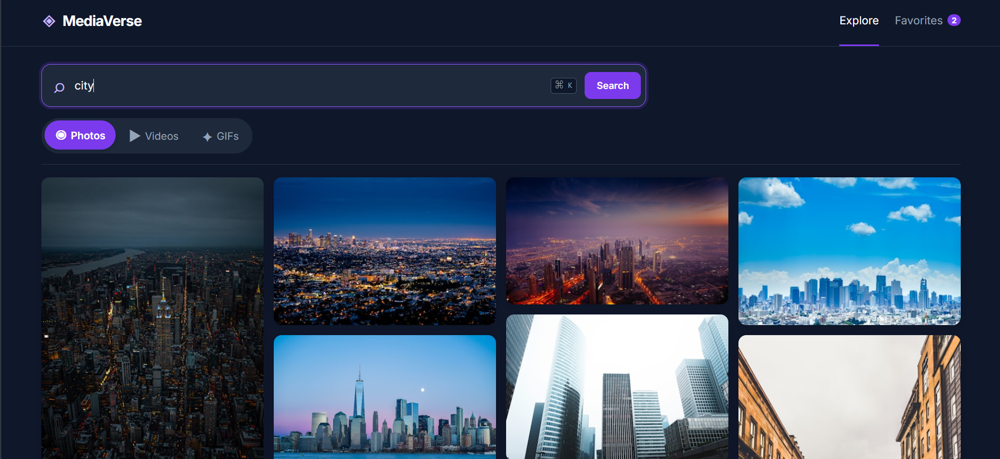
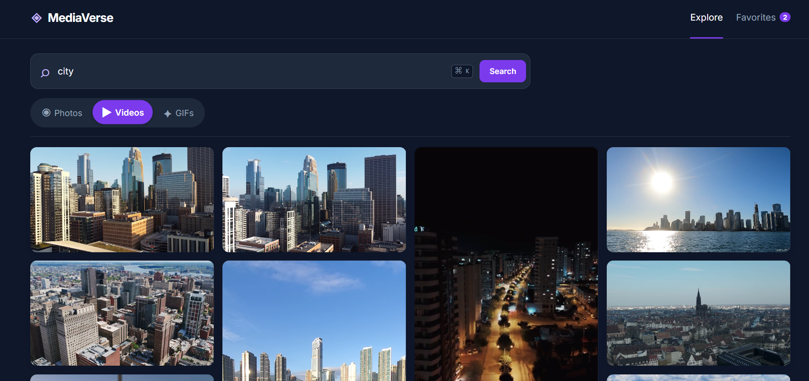
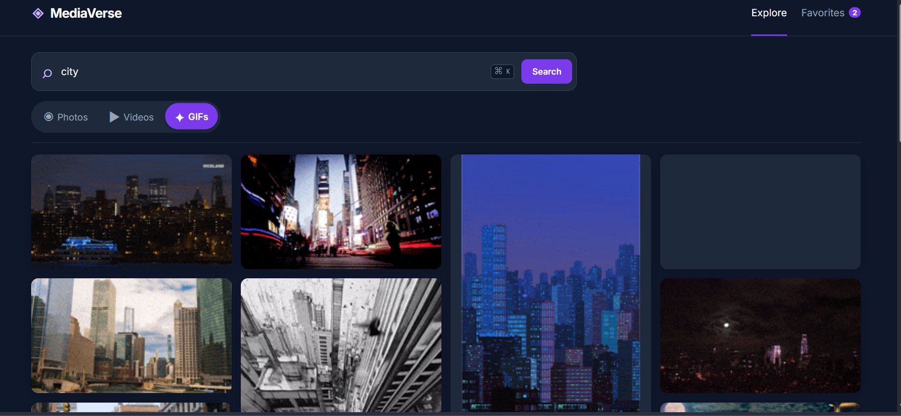
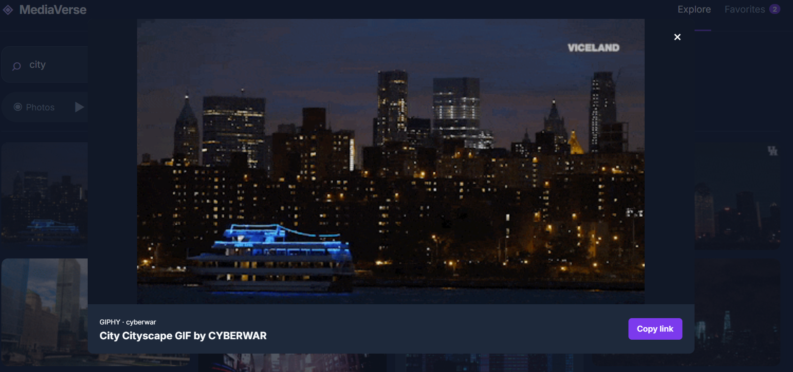
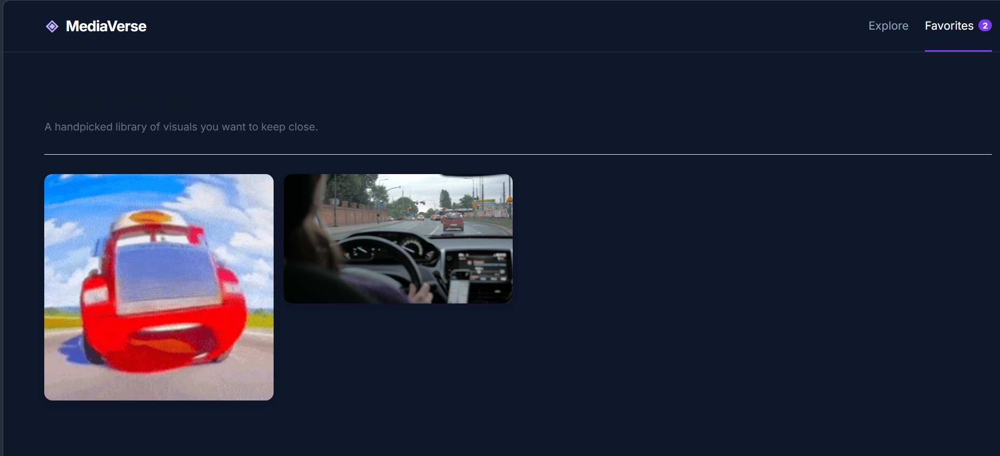

# 🎬 MediaVerse

MediaVerse is a modern media discovery platform built with **React**, **Redux Toolkit**, and **Tailwind CSS**. It allows users to search and explore **photos**, **videos**, and **GIFs** from multiple APIs through a clean, responsive interface.

---

## ✨ Features

- 🔍 Search Photos, Videos, and GIFs
- 📸 Unsplash API integration
- 🎥 Pexels API integration
- 🎞️ GIPHY API integration
- ❤️ Save favorite media with Redux Toolkit
- 📜 Recent search history
- 📱 Fully responsive design
- ⚡ Fast and optimized UI
- 🌙 Modern dark theme

---

## 🛠️ Tech Stack

- React.js
- Redux Toolkit
- Tailwind CSS
- Axios
- Vite
- JavaScript (ES6+)

---

## 🌐 APIs Used

- **Unsplash API** – Photos
- **Pexels API** – Videos
- **GIPHY API** – GIFs

---

## 📸 Screenshots

### Home



### Photos



### Videos



### GIFS



### Image



### Favorites



---

## 🚀 Installation

Clone the repository

```bash
git clone https://github.com/akanksha-codepy/MediaVerse.git
```

Go to the project folder

```bash
cd MediaVerse
```

Install dependencies

```bash
npm install
```

Create a `.env` file in the project root and add your API keys:

```env
VITE_UNSPLASH_API_KEY=your_unsplash_api_key
VITE_PEXELS_API_KEY=your_pexels_api_key
VITE_GIPHY_API_KEY=your_giphy_api_key
```

Run the development server

```bash
npm run dev
```

---

## 📈 Future Improvements

- Infinite scrolling
- Media preview modal
- Download media
- Share media
- Collections
- Better search suggestions

---

## 👩‍💻 Author

**Akanksha Uchale**

- GitHub: https://github.com/akanksha-codepy
- Portfolio: https://akanksha-uchale-portfolio.netlify.app/

---

⭐ If you found this project useful, consider giving it a star!